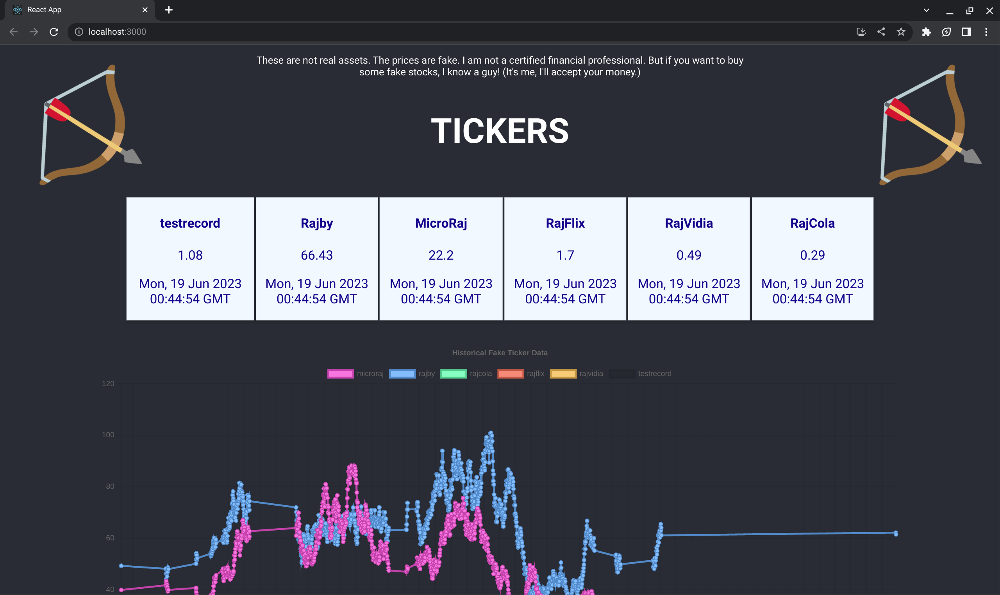

# About this repo

Wanna buy fake stocks? I know a guy!

This is a "RobinHood" clone to use the term loosely,
the purpose of which is to satisfy the requirements
given [here](https://gatsbylabs.notion.site/Simple-Robinhood-44b9db6c84ec4ecdb6cb8785b843ee92).

This repository is a Lerna / NX monorepo, containing
in the services folder a simulated NASDAQ backend that generates
random prices every second and publishes them 1 way to our application backend,
rajbinhood_api. There is also a React frontend in services/frontend
that holds components to render our ticker data queried from rajbinhood_api.

Here are some probably good choices:
- Monorepo for ultimate deployability
- Both BE services use SQLite3 for portable DBs, and easy seeding
- Both BE services are full MVC applications so there is intuitive structure
- All BE additional code is tested 100%
- The data model is simple and clean for both BE services (could definitely be improved for scale)
- There is a skeleton CI CD setup on this repo to allow for no merges under bad linting or failed tests
- The repo itself has some good practices in reviews etc
- There's not too much security setup for the purposes of easy demo
- Used 18n to hold body text with translations for accessibility 

The bad?:
- Security is weak, could use API keys, CORS... HTTPS too
- No observability stack, it's a tiny app and logging is an afterthought
- No FE testing or automated regression testing with screenshots
- SQLite3 is not for production and never will be
- This app is slow - needs a production build
- Need to clean up some dependencies I don't need (the usual)
- Went fast so git commit messages are sloppy
- No real tickets so I made them up, PR bodies are missing sometimes, and no reviews (I'd never work this way professionally)

# Instructions to build and run

Clone the repo
```bash
git clone https://github.com/finch127/RajbinHood.git
```

Enter the repo
```bash
cd ./RajbinHood
```

Install all packages
```bash
npm i
```

Run the app in development mode
```bash
npx lerna run start
```

That should get you close enough.

# Screenshots and Video

[video](https://github.com/finch127/RajbinHood/assets/19713518/018feca5-b6c4-4910-95fc-fa37dc06d62d)


